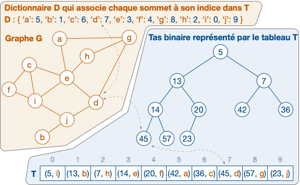
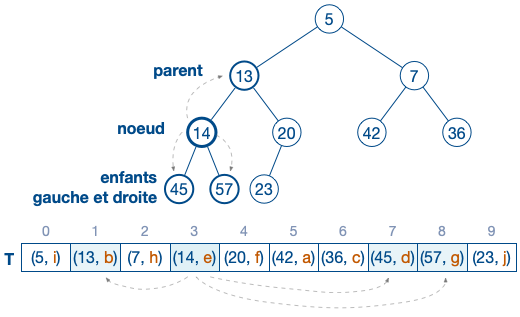
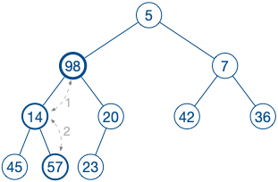
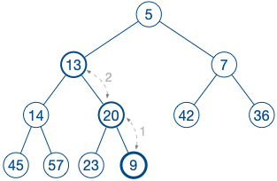

# Les tas binaires

Une file de priorité peut être implémentée par un **tas binaire**.
Un tas binaire est un **arbre binaire** presque complet : uniquement le dernier niveau de l'arbre peut ne pas être complet. L'arbre est représenté par un **tableau**; en Python, nous utilisons une **liste** $T$.

Puisque ce tas représentera les valeurs associées aux sommets d'un graphe $G$, nous conservons également dans un *dictionnaire* $D$ la correspondance entre les sommets de $G$ et l'indice dans $T$ représentant la valeur associée au sommet.

> Attention : dans la suite, nous parlerons indifféremment de **clés**, de **sommets** ou d'**éléments**.




*Figure de droite:  exemple d'arbre presque complet et le tableau $T$ qui le représente.
Figure de gauche: un graphe $G$ et un dictionnaire $D$. A chaque sommet $x \in G$ est associé une valeur dans $T$.*


## Fonctions de base

Nous définissons trois fonctions qui servent à manipuler les listes représentant des arbres binaires :


````python
def parent(i):
    """ étant donné l'indice 'i' d'un nœud,
    retourne l'indice du nœud parent """
    pass

def gauche(i):
    """ étant donnée l'indice 'i' d'un nœud,
    retourne l'indice de l'enfant de gauche """
    pass

def droite(i):
    """ étant donné  l'indice 'i' d'un nœud,
    retourne l'indice de l'enfant de gauche """
    pass
````

La figure suivante montre comment obtenir les indices du parents et des enfants d'un nœud. Ces indices s'obtiennent très facilement.




## Propriété $\Delta$ des tas binaires

Pour être un **tas binaire**, l'arbre doit respecter une propriété essentielle :
> $(\Delta)$ Pour tout nœud i, nous avons $T[parent(i)] \leq T[i]$.


## Réparer un tas binaire (aka heapify)

Il se peut que nous soyons confrontés à un nœud pour lequel la propriété $(\Delta)$ ne soit pas satisfaite.
La fonction ``vers_feuilles`` se charge de le réparer. Ok, mais comment ?



*Figure : la clé 98 doit descendre vers le bas de l'arbre. Elle est d'abord échangé avec la clé 14, puis échangé avec la clé 57.*

Supposons que $T[i]$ soit éventuellement plus grand que ses enfant et supposons que, pour chacun des arbres enracinés aux nœuds d'indice `gauche(i)` et d'indices `droite(i)`, la propriété $(\Delta)$ soit satisfaite.
 La fonction ``vers_feuilles`` fait *descendre* la valeur de $T[i]$ vers une feuille de l'arbre. Cette fonction peut-être implémentée de façon *itérative* ou *récursive*.

 **Comment fonctionne-t-elle ?**
L'idée est d'*échanger* T[i] avec l'enfant ayant la plus petite valeur.
Si cet échange provoque une nouvelle contradiction sur la propriété $(\Delta)$, alors il faut continuer de résoudre ce nouveau problème.


````python
def vers_feuilles(i):
    """ étant donné l'indice 'i' d'un nœud,
    répare la propriété des tas pour ce nœud """
    pass
````


## Un tas binaire comme file de priorité

Nous avons besoins de quelques fonctions supplémentaires offrant la possibilité :
- d'**insérer** un nouvel élément dans le tas;
- de **mettre à jour** la valeur d'un élémént;
- d'**extraire** l'élément de plus petite valeur;
- d'**accéder** à la valeur d'un élément.


### insertion et mise à jour de la valeur d'un élément

L'insertion d'un élément fonctionne algorithmiquement ainsi:
- si l'élémént est déjà présent, alors:
    - sa clé est modifiée (par une valeur inférieure);
    - on lui applique ``vers_racine`` qui a pour objectif de faire *remonter* ce nœud vers la racine.

- si l'élément est nouveau, alors il est simplement ajouté à la fin de $T$, puis ``vers_racine`` lui est appliqué pour le faire *remonter* vers la racine.




*Figure : la nouvelle clé $9$ est insérée à la fin de $T$. Elle doit remonter vers la racine par une succession d'échanges. Elle est d'abord échangée avec $20$, puis avec $13$.*


La fonction `vers_racine(i)` se charge (si nécessaire) d'échanger T[i] avec son parent. Si cet échange provoque une contradiction sur la propriété $(\Delta)$, alors il faut recommencer d'échanger avec le parent. Cette fonction peut être implémentée pour s'exécuter de façon *itérative* ou *récursive*.

````python
def vers_racine(i):
    """ étant donné l'indice 'i' d'un nœud,
    fait remonter ce nœud vers la racine """
    pass

def __setitem__(key, newprio)::
    """ insère une clé 'key' et sa valeur 'newprio' (nouvelle ou inférieure à la valeur précédente) """
    pass
````


En python, c'est la fonction `__setitem__` qui se charge d'insérer ou modifier une valeur dans la file de priorité. Si `F` est une file, on pourra simplement écrire `F['s']=42` pour insérer / modifier la valeur associée au sommet `s`.


### extraction de l'élèment de valeur minimum

Attention, cette fonction ne se charge pas uniquement de retourner le couple `(clé, valeur)` de plus petite valuer, mais le supprime également.

Cela demande une petite gymnastique : il faut mettre à jour à la fois le dictionnaire $D$ et la liste $T$. Algorithmiquement, la suppression de l'élément de valeur minimum se fait ainsi :
- la racine de l'arbre est remplacée par le dernier élément de $T$.
- cette nouvelle racine contredit certainement la propriété $(\Delta)$; on lui applique donc ``vers_feuilles``.


### accéder à la valeur d'un élément


Pour accéder élégamment à la valeur d'un élément (par exemple, en écrivant un code` if F['s']==42:`), il suffit d'implémenter la fonction `__getitem__` :


```python
    def __getitem__(self, key):
        """ retourne la valeur associée à une clé"""
        pass
```
